<p align="center">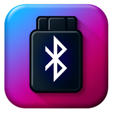</p>
<br>
<br>

# OBDetective
vehicle monitoring system, called OBDetective, using Flutter as the front-end, and Firebase as the back-end. OBDetective is designed to help users register their vehicles and use an OBD-2 device to retrieve the vehicle computer Diagnostic Terminal Code (DTC) data. Moreover, the application provides a service to connect the mechanics and tow truck operators to the vehicle owners. Furthermore, the application is designed to provide AI assistance when analyzing DTC data, GPS service, and offline caching to the user while using the application. Lastly, the Application provides interfaces for each user that are designed to deliver functions for their needs, such as an interface for mechanics, tow truck operators, and vehicle owners alike.

# screenshots

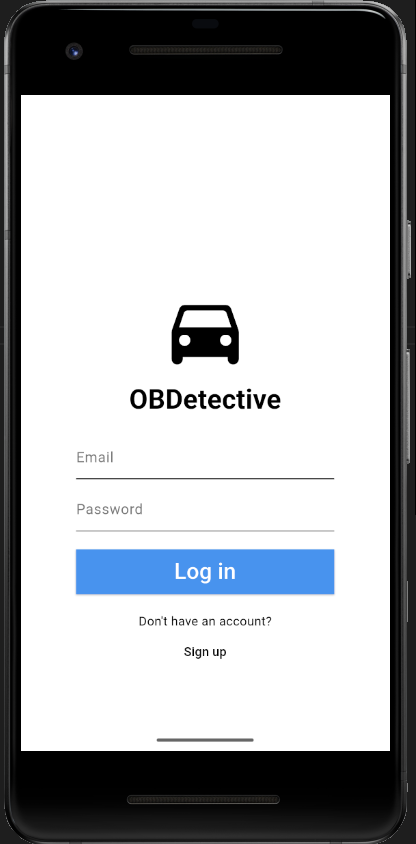
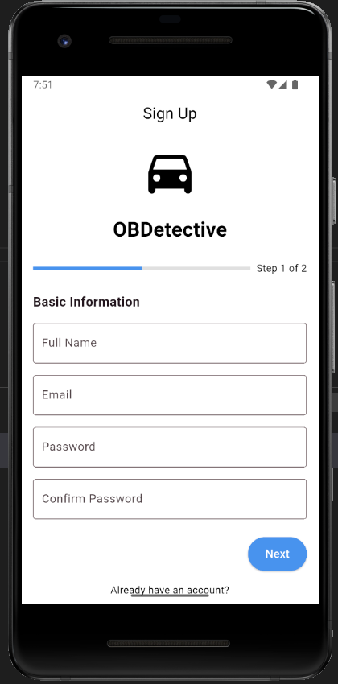
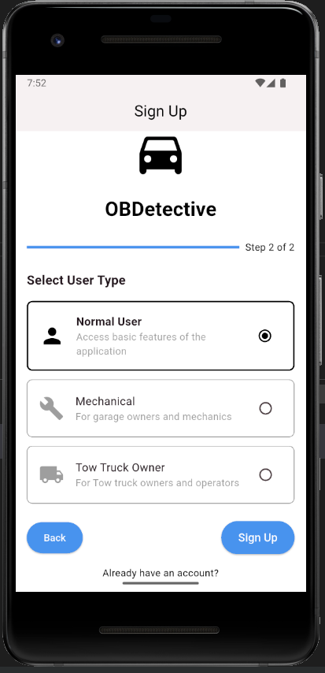
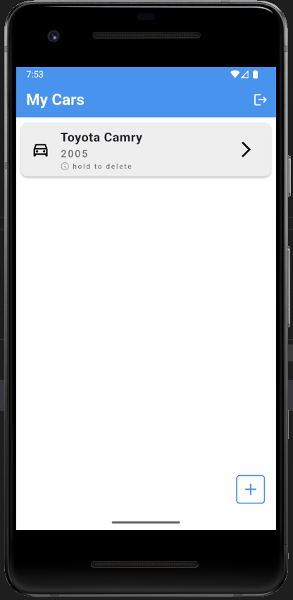
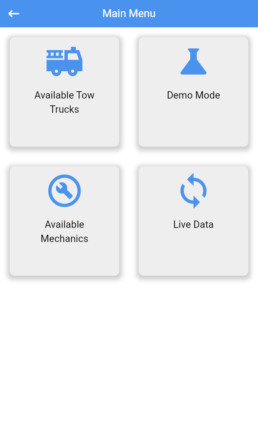
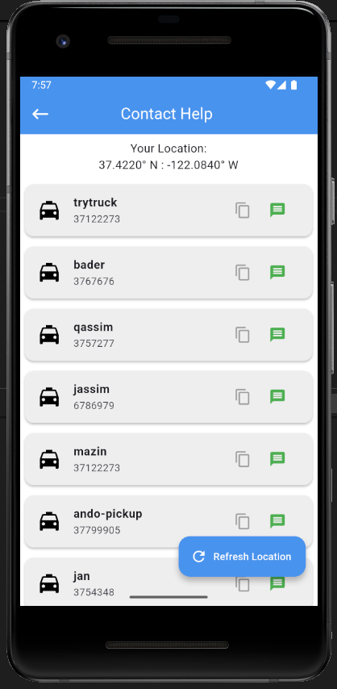

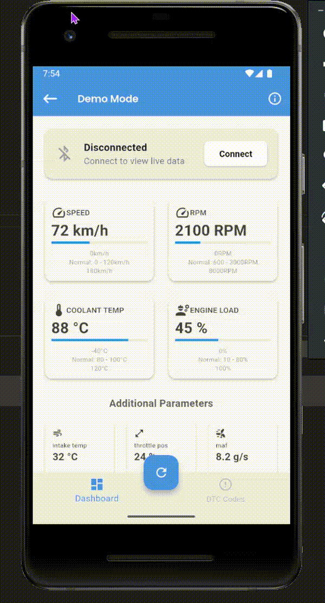

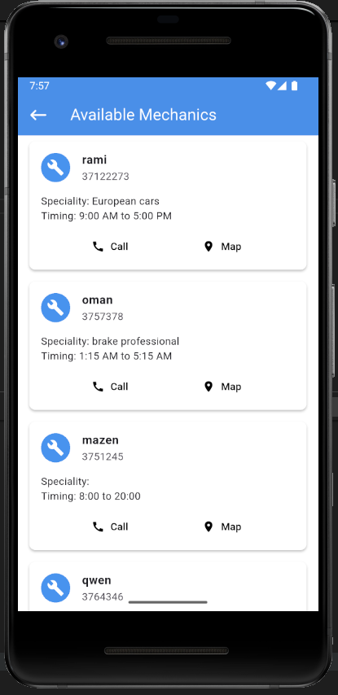
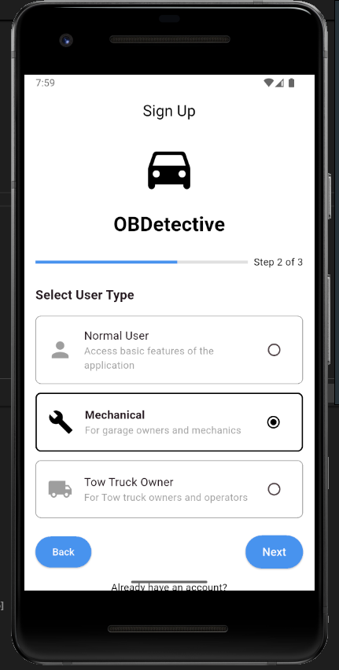
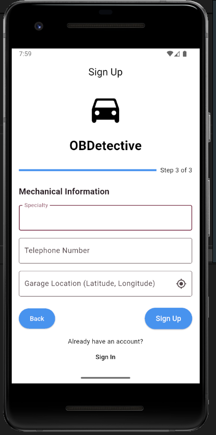
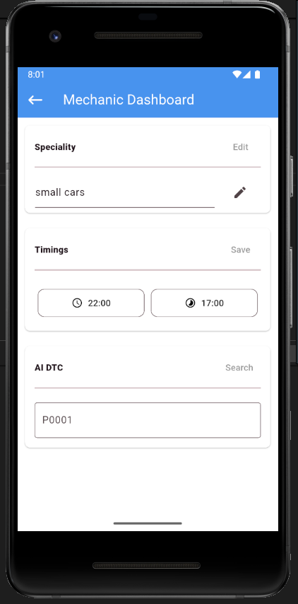
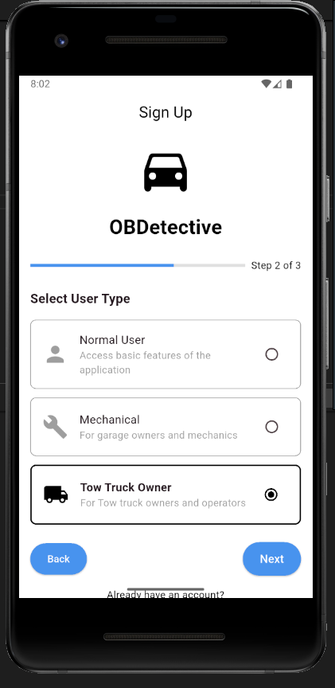
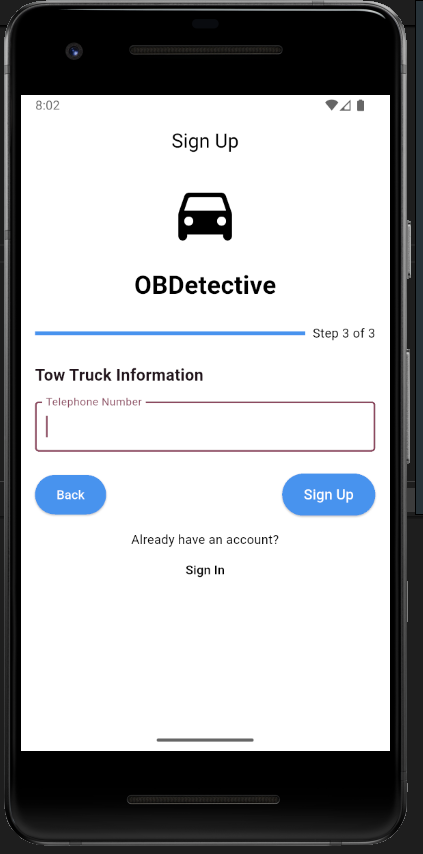
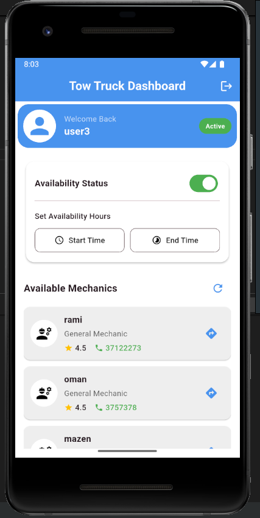


# Tested on
- Android 12 (API 31)
- Android 20 (API 29)

- toyota corolla 2019
- toyota camry 2002


# Features
- Register vehicles
- Retrieve vehicle DTC data
- AI assistance
- GPS service
- Offline caching
- Interface for mechanics
- Interface for tow truck operators
- Interface for vehicle owners

# Technologies
- Flutter
- Firebase
- OBD-II
- AI
- GPS
- Offline caching


# Installation
1. Clone the repository
```bash
git clone https://github.com/your-username/OBDetective.git
```
2. Install the dependencies
```bash
flutter pub get
```
3. Run the application
```bash
flutter run
```
# Future Plans
- [ ] Add more features
- [ ] Improve the user interface
- [ ] Add more AI assistance
- [ ] Add more GPS services
- [ ] Add live chat support
- [ ] Add support for multiple vehicles

